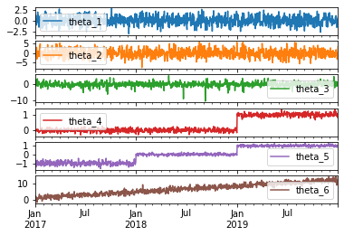
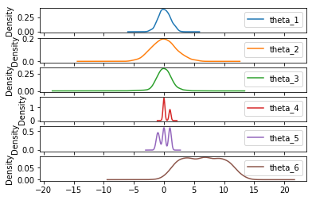
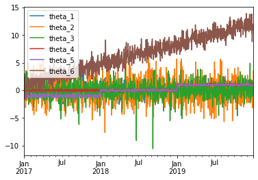
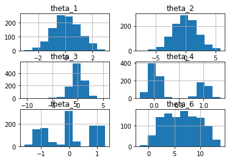
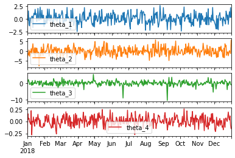
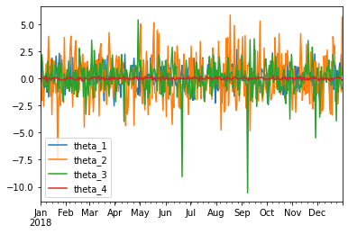
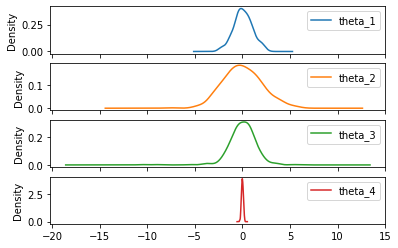
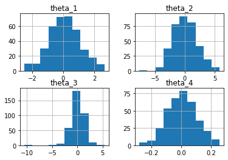

```python
# Aleksandra Spiecha
# Exercise 1
```


```python
import pandas as pd
import datetime as dt
import matplotlib.pyplot as plt
import scipy
```


```python
# Import Data1.csv file and and set first column as an index
data_ex = pd.read_csv('Data1.csv', index_col=0, parse_dates=True)

data_ex.index = pd.to_datetime(data_ex.index)
data_ex.head() # to display the first 5 lines of loaded data
```


<div>
<style scoped>
    .dataframe tbody tr th:only-of-type {
        vertical-align: middle;
    }

    .dataframe tbody tr th {
        vertical-align: top;
    }

    .dataframe thead th {
        text-align: right;
    }
</style>
<table border="1" class="dataframe">
  <thead>
    <tr style="text-align: right;">
      <th></th>
      <th>theta_1</th>
      <th>theta_2</th>
      <th>theta_3</th>
      <th>theta_4</th>
      <th>theta_5</th>
      <th>theta_6</th>
    </tr>
  </thead>
  <tbody>
    <tr>
      <th>2017-01-01</th>
      <td>0.756936</td>
      <td>-1.467790</td>
      <td>0.096136</td>
      <td>-0.115306</td>
      <td>-0.447908</td>
      <td>0.902579</td>
    </tr>
    <tr>
      <th>2017-01-02</th>
      <td>0.767089</td>
      <td>0.185797</td>
      <td>-1.428536</td>
      <td>-0.086443</td>
      <td>-0.954288</td>
      <td>1.930909</td>
    </tr>
    <tr>
      <th>2017-01-03</th>
      <td>0.404544</td>
      <td>1.415887</td>
      <td>0.443466</td>
      <td>0.000200</td>
      <td>-0.892351</td>
      <td>2.449691</td>
    </tr>
    <tr>
      <th>2017-01-04</th>
      <td>1.313957</td>
      <td>-1.804471</td>
      <td>-0.836986</td>
      <td>0.011785</td>
      <td>-1.012518</td>
      <td>1.182085</td>
    </tr>
    <tr>
      <th>2017-01-05</th>
      <td>0.209862</td>
      <td>1.315868</td>
      <td>0.140993</td>
      <td>-0.046473</td>
      <td>-1.417092</td>
      <td>1.742433</td>
    </tr>
  </tbody>
</table>
</div>


```python
# Plot all columns as time series
data_ex.plot(subplots=True)
plt.show()
```


    

    


```python
# Plot KDE for all columns
data_ex.plot.density(subplots=True)
plt.show()
```


    

    


```python
# Plot all columns
data_ex.plot()
plt.show()
```


    

    


```python
# Plot histograms
data_ex.hist()
plt.show()
```


    

    


```python
# Data from 2018
data_2018 = data_ex.loc['2018', 'theta_1':'theta_4']
data_2018.head()
```


<div>
<style scoped>
    .dataframe tbody tr th:only-of-type {
        vertical-align: middle;
    }

    .dataframe tbody tr th {
        vertical-align: top;
    }

    .dataframe thead th {
        text-align: right;
    }
</style>
<table border="1" class="dataframe">
  <thead>
    <tr style="text-align: right;">
      <th></th>
      <th>theta_1</th>
      <th>theta_2</th>
      <th>theta_3</th>
      <th>theta_4</th>
    </tr>
  </thead>
  <tbody>
    <tr>
      <th>2018-01-01</th>
      <td>0.682693</td>
      <td>-3.091767</td>
      <td>-0.475717</td>
      <td>-0.238530</td>
    </tr>
    <tr>
      <th>2018-01-02</th>
      <td>-0.283107</td>
      <td>-0.979955</td>
      <td>1.233933</td>
      <td>0.158031</td>
    </tr>
    <tr>
      <th>2018-01-03</th>
      <td>1.572221</td>
      <td>-2.033528</td>
      <td>2.196317</td>
      <td>0.041347</td>
    </tr>
    <tr>
      <th>2018-01-04</th>
      <td>-1.042981</td>
      <td>0.651530</td>
      <td>1.060125</td>
      <td>0.064832</td>
    </tr>
    <tr>
      <th>2018-01-05</th>
      <td>-1.392614</td>
      <td>-2.570905</td>
      <td>-0.600063</td>
      <td>-0.015025</td>
    </tr>
  </tbody>
</table>
</div>


```python
data_2018.plot(subplots=True)
plt.show()
```


    

    


```python
data_2018.plot()
plt.show()
```


    

    


```python
data_2018.plot.density(subplots=True)
plt.show()
```


    

    


```python
data_2018.hist()
plt.show()
```


    

    

